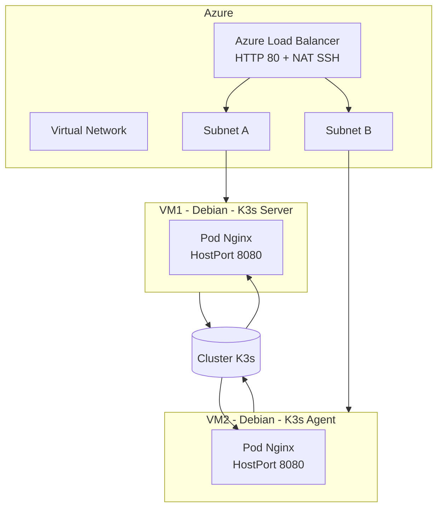

# 🚀 Déploiement automatisé d’un cluster K3s sur Azure avec Terraform & Vault

## 📋 Contexte du projet

Ce projet a été réalisé dans le cadre du **Master 2** (module Cloud & Infrastructure as Code).  
L’objectif est de **concevoir et déployer une infrastructure complète sur Microsoft Azure** en utilisant **Terraform**, **Vault** et **K3s** (Kubernetes léger).

### 🎯 Objectifs pédagogiques
- Mettre en œuvre une **infrastructure reproductible et automatisée** avec Terraform.  
- Déployer un **cluster Kubernetes (K3s)** sur deux machines virtuelles Debian.  
- Gérer les **secrets Azure** et les **clés SSH** de manière sécurisée via **Vault**.  
- Implémenter un **Load Balancer** pour assurer la haute disponibilité.  
- Déployer automatiquement un **pod Nginx dynamique** sur le cluster via **cloud-init**.  
- Optimiser les ressources Azure (limitées à 3 IP publiques maximum sur le compte Student).

---

## 🏗️ Architecture globale



---

## ⚙️ Technologies et outils utilisés

| Outil | Rôle |
|-------|------|
| **Terraform** | Provisionnement Infrastructure-as-Code |
| **Azure** | Cloud provider |
| **Vault** | Gestion sécurisée des secrets (Azure client_secret, clé SSH publique) |
| **K3s** | Cluster Kubernetes léger (installé via cloud-init) |
| **cloud-init** | Automatisation du bootstrap des VM |
| **Nginx** | Pod déployé sur chaque nœud K3s, servant une page HTML dynamique |
| **Load Balancer Azure** | Distribution du trafic entre les deux nœuds |

---

## 🧩 Structure du projet

```
.
├── provider.tf          # Configuration du provider Azure + Vault
├── variables.tf         # Déclaration des variables globales
├── network.tf           # Virtual Network et sous-réseaux
├── nsg.tf               # Groupes de sécurité (SSH + ICMP)
├── loadbalancer.tf      # Load Balancer + NAT rules
├── vm.tf                # Déploiement des VM + cloud-init
├── outputs.tf           # Sorties utiles (IPs, URLs)
└── cloudinit/
    ├── server.tpl       # Bootstrap du nœud K3s server
    └── agent.tpl        # Bootstrap du nœud K3s agent
```

---

## 🚀 Déploiement pas à pas

### 1️⃣ Préparation de l’environnement

Installe les dépendances :
```bash
terraform -v
vault -v
az version
```

Connecte ton compte Azure :
```bash
az login
```

Vérifie que ton secret Azure et ta clé SSH publique sont bien stockés dans Vault :
```
secret/azure → client_secret
ssh/public_key → contenu de ta clé publique
```

---

### 2️⃣ Initialisation Terraform

```bash
terraform init
terraform validate
```

---

### 3️⃣ Planification et déploiement

```bash
terraform plan
terraform apply -auto-approve
```

> 💡 Le déploiement complet prend environ **5 à 10 minutes**.

---

## 🔧 Explications techniques

### 🌩️ Cloud-init (automatisation K3s)
- **server.tpl** → installe K3s (mode `server`) et déploie automatiquement un DaemonSet Nginx dynamique.  
- **agent.tpl** → rejoint automatiquement le cluster via l’adresse IP privée du serveur et le token partagé.  

### 🌐 Load Balancer Azure
- **1 seule IP publique** (optimisation quota Azure Student).  
- NAT SSH :  
  - Port `50001` → VM1  
  - Port `50002` → VM2  
- HTTP : Port `80` vers les pods Nginx exposés sur chaque hôte.

---

## 📊 Vérification du déploiement

### 🔹 Vérifier les sorties Terraform
```bash
terraform output
```

Exemple :
```
lb_public_ip = "20.55.123.10"
vm1_ssh = "ssh -p 50001 azureuser@20.55.123.10"
vm2_ssh = "ssh -p 50002 azureuser@20.55.123.10"
```

### 🔹 Accéder à la page Nginx
```
http://<lb_public_ip>
```

En rafraîchissant plusieurs fois :
```
Bonjour depuis le cluster K3s
Hostname: k3s-server
IP privée: 10.0.1.X
```
puis
```
Bonjour depuis le cluster K3s
Hostname: k3s-agent
IP privée: 10.0.2.X
```

### 🔹 Vérifier le cluster K3s
```bash
ssh -p 50001 azureuser@<LB_IP>
sudo k3s kubectl get nodes
sudo k3s kubectl get pods -A
```

Sortie attendue :
```
NAME         STATUS   ROLES                  AGE   VERSION
k3s-server   Ready    control-plane,master   2m    v1.27.x+k3s
k3s-agent    Ready    <none>                 1m    v1.27.x+k3s
```

---

## 🧠 Points forts techniques

- 🌩️ Infrastructure **100% déclarative et automatisée**
- 🔐 Sécurisation via **Vault**
- 🐳 Cluster Kubernetes **léger et reproductible**
- ⚡ **Cloud-init** : installation & déploiement en un seul flux
- 🌐 **Load Balancer intelligent** + NAT SSH
- ♻️ **Optimisation IPs Azure Student**

---

## 🏁 Conclusion

Ce projet démontre :
- la maîtrise complète du **provisionnement cloud avec Terraform**,  
- la **sécurisation des secrets** via Vault,  
- et la **mise en production automatisée** d’un cluster K3s fonctionnel sur Azure.  

> 📈 Résultat : un déploiement 100 % automatisé, scalable, et conforme aux meilleures pratiques DevOps.
